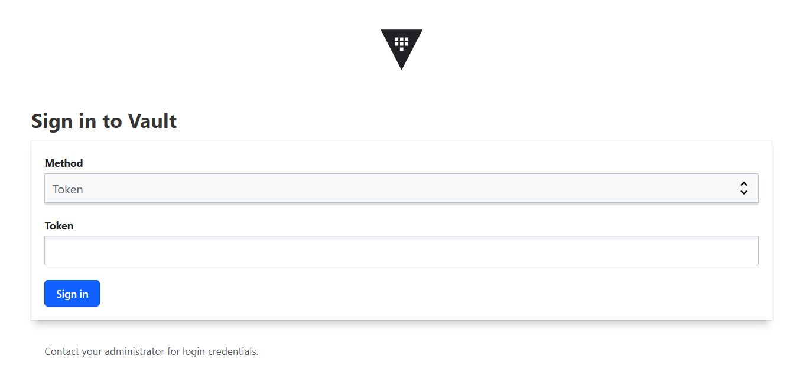
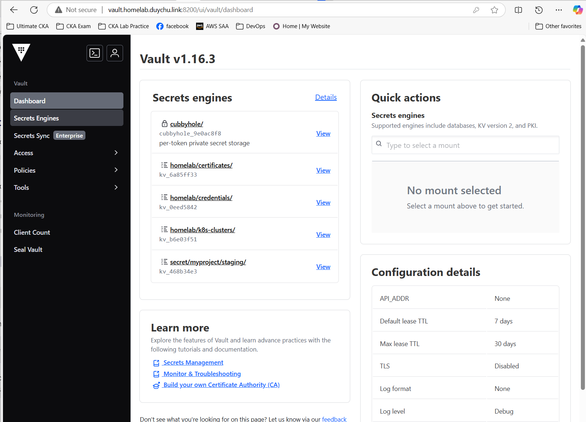

name: Chapter-2
class: title, shelf, no-footer, fullbleed
background-image: url(https://hashicorp.github.io/field-workshops-assets/assets/bkgs/HashiCorp-Title-bkg.jpeg)
count: false

# Chapter 2      
## Interacting With Vault


???
Chapter 2 focuses on interacting with Vault


---
name: Interacting-With-Vault
# Interacting With Vault

Vault provides several mechanisms for interacting with it:
* The Vault [CLI](https://developer.hashicorp.com/vault/docs/commands)
* The Vault [UI](https://developer.hashicorp.com/vault/docs/ui)
* The Vault [API](https://developer.hashicorp.com/vault/api-docs)

???

* Chapter 2 focuses on interacting with Vault

---
name: Vault-CLI
# The Vault CLI
* The Vault CLI is a Go application.
* It runs on macOS, Windows, Linux, and other operating systems.
* You can download the latest version [here](https://www.vaultproject.io/downloads/).

???
* The Vault CLI is distributed as a Go binary.
* It runs on multiple operating systems.

---
name: some-cli-commands
# Some Basic Vault CLI Commands
* `vault` by itself will give you a list of many Vault CLI commands.
  * The list starts with the most common ones.
* `vault version` tells you the version of Vault you are running.
* `vault read` is used to read secrets from Vault.
* `vault write` is used to write secrets to Vault.

The `-h`, `-help`, and `--help` flags can be added to get help for any Vault CLI command.

???
Let's discuss some of the basic Vault CLI commands.


---
name: vault-server-modes
# Vault Server Modes
Vault servers can be run in two different modes:
* "Dev" mode that is only intended for development
* "Prod" mode that can be used in QA and production

???
* Discuss Vault's two server modes


---
name: vault-dev-server
# Vault's "Dev" Mode
* It is not secure.
* It stores everything in memory.
* Vault is automatically unsealed.
* The root token can be specified before launching.

**Please never store actual secrets on a server run in "Dev" mode.**

???
* Discuss limitations of Vault's "Dev" mode.
* Warn students to never store real secrets on a Dev server.


---
name: Vault-UI
# The Vault UI
* In order to use the Vault UI, you must sign in.
* Vault supports multiple authentication methods.
* A new Vault server will only have the Token auth method enabled.
* In the challenge you will soon complete, you use the Token auth method and specify "root" as the token.

???

* Let's talk about the Vault UI a bit, including ways of signing into it.
* While you used the token "root" in the last challenge, you'll be running a Vault server in "Prod"  mode in the rest of the track and will have to use the token generated when you initialize that server in the next challenge.

---
name: signing-into-the-vault-ui
# Signing into the Vault UI
.center[]

???
* This slide shows a screenshot of the login dialog for the Vault server.


---
name: welcome-to-vault
# The "Welcome to Vault" Tour
.center[]

???
* Explain the "Welcome to Vault" tour.
* Explain how to get rid of it.
* Point out that they can restart the tour with the "Restart guide" menu under their user icon in the upper right corner of the UI.


---
name: vault-api-1
# The Vault API

* Vault has an HTTP API that you can use to configure Vault and manage your secrets.
* You can check Vault's health with a simple `curl` command followed by `jq` to format the JSON output.

```bash
curl http://localhost:8200/v1/sys/health | jq
```

```json
{
    "initialized": true,
    "sealed": false,
    "standby": false,
    "performance_standby": false,
    "replication_performance_mode": "disabled",
    "replication_dr_mode": "disabled",
    "server_time_utc": 1736588172,
    "version": "1.17.3",
    "enterprise": false,
    "cluster_name": "vault-cluster-bd2470be",
    "cluster_id": "027cf597-bd0a-731a-a57e-dcd06eb390e4",
    "echo_duration_ms": 0,
    "clock_skew_ms": 0,
    "replication_primary_canary_age_ms": 0
}
```

???
* Let's talk about the Vault HTTP API

---
name: vault-api-3
# Authenticating Against the Vault API

* The sys/health endpoint didn't require any authentication.
* But most Vault API calls do require authentication.
* This is done with a Vault token that is provided with the `X-Vault-Token` header.

???
* Talk about how most Vault HTTP API calls will require authentication with a Vault token.


---
name: vault-docker-compose-1
# Bootup with vault with docker-compose

* In production, docker-compose is not used, however, we can still use it to understand what need to do if vault is setup for production use
* We have to unseal vault when vault server start, it is done by vault-init script

```yaml
services:
  vault:
    image: "hashicorp/vault:${VAULT_TAG:-latest}"
    container_name: vault
    restart: always
    ports:
      - "8200:8200"
    volumes:
      - ./vault/config:/vault/config
      - ./vault/data:/vault/data
    command: ["vault", "server", "-config=/vault/config/vault-config.json"]
    cap_add:
      - IPC_LOCK
```
---

* We have to unseal vault when vault server start, it is done by vault-init script

```yaml
  vault-init:
    image: "hashicorp/vault:${VAULT_TAG:-latest}"
    container_name: vault-init
    restart: always
    command:
      # - tail
      # - -f
      # - /dev/null
      - "sh"
      - "-c"
      - "/vault/scripts/vault-init.sh"
    environment:
      VAULT_ADDR: http://vault:8200
    volumes:
      - ./vault/scripts/vault-init.sh:/vault/scripts/vault-init.sh
      - ./vault/keys:/vault/keys
      - ./vault/root:/vault/root
    depends_on:
      vault:
        condition: service_started
```

---
* `vault/scripts/vault-init.sh` script will do 2 thing, generate root key to init vault in 1st setup, and unseal the vault if vault is setup but just be restarted

```bash
#! /bin/sh
set -ex
apk update
apk add jq

INIT_FILE=/vault/keys/vault.init
if [[ -f "${INIT_FILE}" ]]; then
  echo "${INIT_FILE} exists. Vault already initialized."
else
  echo "Initializing Vault..."
  sleep 20 # fixme: need to check tcp port by nc
  vault operator init -key-shares=3 -key-threshold=2 | tee ${INIT_FILE} > /dev/null ### 3 fragments, 2 are required to unseal
  ### Store unseal keys to files
  COUNTER=1
  cat ${INIT_FILE} | grep '^Unseal' | awk '{print $4}' | for key in $(cat -); do
    echo "${key}" > /vault/keys/key-${COUNTER}
    COUNTER=$((COUNTER + 1))
  done
 
  ### Store Root Key to file
  cat ${INIT_FILE}| grep '^Initial Root Token' | awk '{print $4}' | tee /vault/root/token > /dev/null
  echo "Vault setup complete."
fi
```
---
* We have to unseal vault when vault server start, it is done by vault-init script. In real, this key should be kept by different person(s) who are in charge of vault

```bash
if [ ! -s /vault/root/token -o ! -s /vault/keys/key-1 -o ! -s /vault/keys/key-2 ] ; then
  echo "Vault is initialized, but unseal keys or token are mssing"
  return
fi

echo "Unsealing Vault"
export VAULT_TOKEN=$(cat /vault/root/token)
vault operator unseal "$(cat /vault/keys/key-1)"
vault operator unseal "$(cat /vault/keys/key-2)"

vault status
```

---
name: chapter-2-review-questions
# 📝 Chapter 2 Review

* How can you interact with Vault?
* What options can you use to get help for Vault commands?
* What are the two Vault server modes?

???
* Let's review what we learned in this chapter.

---
name: chapter-2-review-answers
# 📝 Chapter 2 Review
* How can you interact with Vault?
  * The Vault CLI
  * The Vault UI
  * The Vault API
* What options can you use to get help for Vault commands?
  * `-h`, `-help`, and `--help`
* What are the two Vault server modes?
  * Dev and Prod

???
* Here are the answers to the review questions.