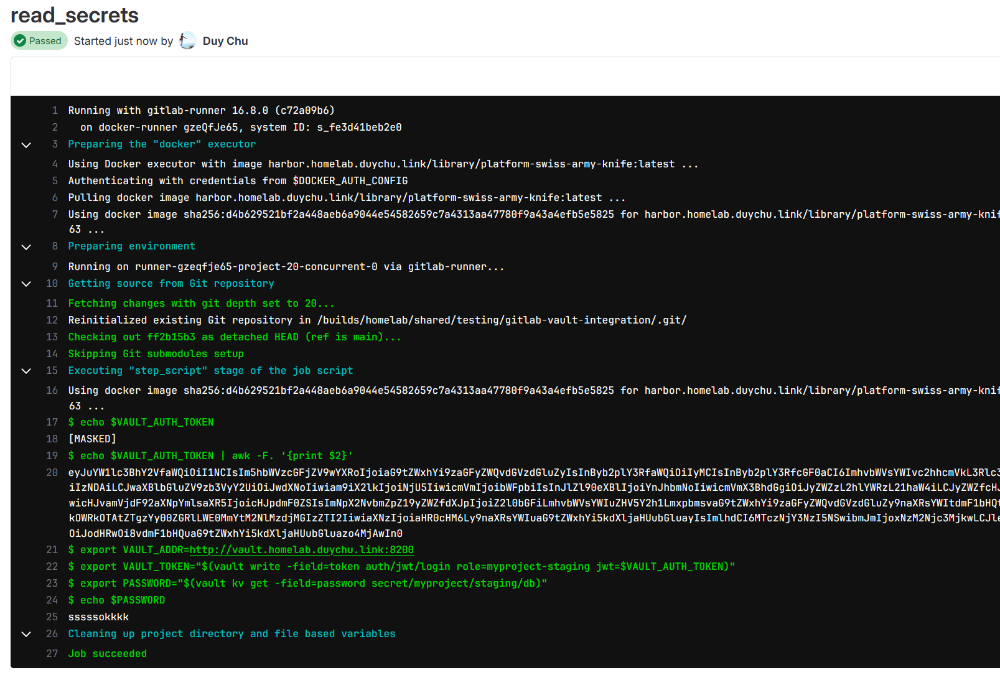
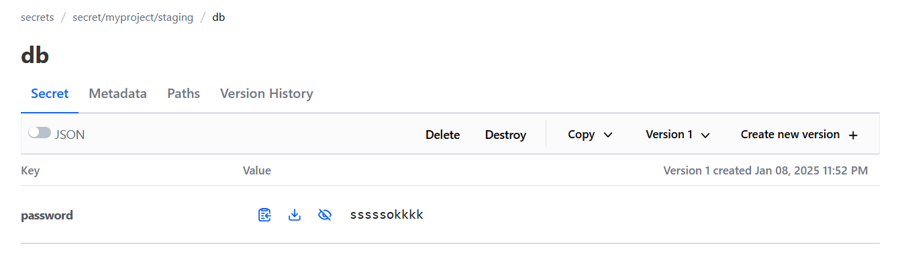

name: Chapter-7
class: title, shelf, no-footer, fullbleed
background-image: url(https://hashicorp.github.io/field-workshops-assets/assets/bkgs/HashiCorp-Title-bkg.jpeg)
count: false

# Chapter 7
## [Lab] Integrate Vault with GitLab Community version

---
# [Lab-3] Integrate Vault with GitLab Community version

Notes:
- Community version of gitlab does not support vault integration as easy as enterprise version does.
- However, the process of integration can be done through [this guide line](https://docs.gitlab.com/ee/ci/secrets/)

References:
- https://docs.gitlab.com/ee/ci/secrets/index.html#configure-your-vault-server
- https://developer.hashicorp.com/well-architected-framework/security/security-cicd-vault
- https://docs.gitlab.com/ee/ci/secrets/hashicorp_vault.html

---
# [Lab-3] Integrate Vault with GitLab Community version

Steps:
- Enable jwt authentication, we need to insert some CA certificate to let vault trust the token it received from gitlab if you are using self-hosted gitlab locally with no public certificates
- Setup sample secret in vault
- Prepare the vault policy
- Setup role in jwt authentication and link to above vault policy
- Setup sample gitlab-ci.yml to test

---
# [Lab-3] Integrate Vault with GitLab Community version

Enable jwt authentication

```bash
$ vault auth enable jwt
Success! Enabled jwt auth method at: jwt/
```

Setup jwt config authentication with self-hosted CA (since it is locally hosted). oidc_discovery_url is the link that vault can reach to check the [public known oidc information](https://gitlab.homelab.duychu.link/.well-known/openid-configuration)

```bash
cat /usr/local/share/ca-certificates/rootCA.crt

vault write auth/jwt/config \
        oidc_discovery_url="https://gitlab.homelab.duychu.link" \
        bound_issuer="gitlab.homelab.duychu.link" \
        oidc_discovery_ca_pem="$(cat /usr/local/share/ca-certificates/rootCA.crt)"
Success! Data written to: auth/jwt/config
```

---
# [Lab-3] Integrate Vault with GitLab Community version

Prepare vault policy, assume we setup 2 secret for staging and production environment

```bash
$ vault policy write myproject-staging - <<EOF
# Policy name: myproject-staging
#
# Read-only permission on 'secret/myproject/staging/*' path
path "secret/myproject/staging/*" {
  capabilities = [ "read" ]
}
EOF
Success! Uploaded policy: myproject-staging

$ vault policy write myproject-production - <<EOF
# Policy name: myproject-production
#
# Read-only permission on 'secret/myproject/production/*' path
path "secret/myproject/production/*" {
  capabilities = [ "read" ]
}
EOF
Success! Uploaded policy: myproject-production
```

---
# [Lab-3] Integrate Vault with GitLab Community version

One role for staging named myproject-staging. The bound claims is configured to 
only allow the policy to be used for the main branch in all projects. Note that: the bound_claims has many fields, so depend on use case, we can limit access to vault with project_id, branch, ...

```bash
$ vault write auth/jwt/role/myproject-staging - <<EOF
{
  "role_type": "jwt",
  "policies": ["myproject-staging"],
  "token_explicit_max_ttl": 60,
  "user_claim": "user_email",
  "bound_audiences": ["http://vault.homelab.duychu.link:8200", "https://gitlab.homelab.duychu.link"],
  "bound_claims": {
    "ref": "main",
    "ref_type": "branch"
  }
}
EOF
```

---

Doing the samething for role `myproject-production`
```bash
$ vault write auth/jwt/role/myproject-production - <<EOF
{
  "role_type": "jwt",
  "policies": ["myproject-production"],
  "token_explicit_max_ttl": 60,
  "user_claim": "user_email",
  "bound_audiences": ["http://vault.homelab.duychu.link:8200", "https://gitlab.homelab.duychu.link"],
  "bound_claims_type": "glob",
  "bound_claims": {
    "ref_protected": "true",
    "ref_type": "branch",
    "ref": "main"
  }
}
EOF
```

Role is configured properly

```bash
$ vault list auth/jwt/role
Keys
----
myproject-production
myproject-staging
```

---
# [Lab-3] Integrate Vault with GitLab Community version

Update correct bound issuer, this is tricky and you need to check the jwt token that gitlab issues

```bash
vault write auth/jwt/config \
    oidc_discovery_url="https://gitlab.homelab.duychu.link" \
    # before without https:// --> bound_issuer="gitlab.homelab.duychu.link" \
    bound_issuer="https://gitlab.homelab.duychu.link" \
    oidc_discovery_ca_pem="$(cat /usr/local/share/ca-certificates/rootCA.crt)"

```

---
# [Lab-3] Integrate Vault with GitLab Community version

Checkout [sample jwt issued from gitlab ](https://jwt.io/#debugger-io?token=eyJuYW1lc3BhY2VfaWQiOiI1NCIsIm5hbWVzcGFjZV9wYXRoIjoiaG9tZWxhYi9zaGFyZWQvdGVzdGluZyIsInByb2plY3RfaWQiOiIyMCIsInByb2plY3RfcGF0aCI6ImhvbWVsYWIvc2hhcmVkL3Rlc3RpbmcvZ2l0bGFiLXZhdWx0LWludGVncmF0aW9uIiwidXNlcl9pZCI6IjIiLCJ1c2VyX2xvZ2luIjoiZHV5Y2h1IiwidXNlcl9lbWFpbCI6ImR1eWNiOTJAZ21haWwuY29tIiwicGlwZWxpbmVfaWQiOiIzMjgiLCJwaXBlbGluZV9zb3VyY2UiOiJwdXNoIiwiam9iX2lkIjoiNjM1IiwicmVmIjoibWFpbiIsInJlZl90eXBlIjoiYnJhbmNoIiwicmVmX3BhdGgiOiJyZWZzL2hlYWRzL21haW4iLCJyZWZfcHJvdGVjdGVkIjoidHJ1ZSIsInJ1bm5lcl9pZCI6MSwicnVubmVyX2Vudmlyb25tZW50Ijoic2VsZi1ob3N0ZWQiLCJzaGEiOiIyNDFjY2MwNWMwZmIxMzY3MDNjY2I5ZTVjYzU5M2VjYTNhYjI5MDM1IiwicHJvamVjdF92aXNpYmlsaXR5IjoicHJpdmF0ZSIsImNpX2NvbmZpZ19yZWZfdXJpIjoiZ2l0bGFiLmhvbWVsYWIuZHV5Y2h1LmxpbmsvaG9tZWxhYi9zaGFyZWQvdGVzdGluZy9naXRsYWItdmF1bHQtaW50ZWdyYXRpb24vLy5naXRsYWItY2kueW1sQHJlZnMvaGVhZHMvbWFpbiIsImNpX2NvbmZpZ19zaGEiOiIyNDFjY2MwNWMwZmIxMzY3MDNjY2I5ZTVjYzU5M2VjYTNhYjI5MDM1IiwianRpIjoiOGUyMDFjNzgtYzI1Yy00YzJlLTg1MzYtMmVkZmFhZjYxMzViIiwiaXNzIjoiaHR0cHM6Ly9naXRsYWIuaG9tZWxhYi5kdXljaHUubGluayIsImlhdCI6MTczNjM1NDI2MSwibmJmIjoxNzM2MzU0MjU2LCJleHAiOjE3MzYzNTc4NjEsInN1YiI6InByb2plY3RfcGF0aDpob21lbGFiL3NoYXJlZC90ZXN0aW5nL2dpdGxhYi12YXVsdC1pbnRlZ3JhdGlvbjpyZWZfdHlwZTpicmFuY2g6cmVmOm1haW4iLCJhdWQiOiJodHRwczovL2dpdGxhYi5ob21lbGFiLmR1eWNodS5saW5rIn0)


```yaml
read_secrets:
  image: harbor.homelab.duychu.link/library/platform-swiss-army-knife:latest
  id_tokens:
    VAULT_AUTH_TOKEN:
      # this is mistake: we should use aud is vault, since vault is the audience of this token
      aud: https://gitlab.homelab.duychu.link
  script:
    - echo $VAULT_AUTH_TOKEN
    - echo $VAULT_AUTH_TOKEN | awk -F. '{print $2}'
    - export VAULT_ADDR=http://vault.homelab.duychu.link:8200
    # authenticate and get token. Token expiry time and other properties can be configured
    # when configuring JWT Auth - https://developer.hashicorp.com/vault/api-docs/auth/jwt#parameters-1
    - export VAULT_TOKEN="$(vault write -field=token auth/jwt/login role=myproject-staging jwt=$VAULT_AUTH_TOKEN)"
    # use the VAULT_TOKEN to read the secret and store it in an environment variable
    - export PASSWORD="$(vault kv get -field=password secret/myproject/staging/db)"
    - echo $PASSWORD

```

---
# [Lab-3] Integrate Vault with GitLab Community version

.split-50[
.column[]
.column[]
]