class: center, middle, title, shelf, no-footer, fullbleed
background-image: url(https://hashicorp.github.io/field-workshops-assets/assets/bkgs/HashiCorp-Title-bkg.jpeg)

# Kubernetes Security
### Application Architect - CoE Team

#### Introduce The 4 C's of Kubernetes Security and useful Tools for better Security Performance.

<br />
<br />
<br />
<br />
.right[Presenter: Lu Hoang Anh (Andre) - Associate DevOps Engineer]

---

# Agenda: Modules

1. Kubernetes and Cloud Security Basics
2. Cluster Security
3. Container Security
4. Code Security
5. [All-in-one] Demo

---

# 🚀 Warm-Up: Cybercrime Analogy Challenge 

### 🕵️ Can You Guess the Cyber Threat? 

Each of these criminals represents a type of malware. Can you match them? 🤔

| **Criminal Behavior** | **Which Malware Is It?** (Guess!) |
|----------------------|----------------------------------|
| A criminal who hides in a package and harms you when opened. | .center[❓] |
| A criminal who sneaks into every house on its own. | .center[❓]|
| A disguised criminal pretending to be friendly but actually dangerous. | .center[❓] |

---

# 🚀 Warm-Up: Cybercrime Analogy Challenge 

### 🕵️ Can You Guess the Cyber Threat? 

Each of these criminals represents a type of malware. Can you match them? 🤔

| **Criminal Behavior** | **Which Malware Is It?** (Guess!) |
|----------------------|----------------------------------|
| A criminal who hides in a package and harms you when opened. | .center[❓] |
| A criminal who sneaks into every house on its own. | .center[❓]|
| A disguised criminal pretending to be friendly but actually dangerous. | .center[❓] |

#### Hint 🔍

Virus, Worm, Trojan, Ransomware

---

# 🚀 Warm-Up: Cybercrime Analogy Challenge 

### 📝 Answer

| **Type**      | **Real-World Example** | **How It Worked** | **Analogy (Cybercrime in Real Life)** |
|--------------|----------------------|------------------|----------------------------------|
| **Virus** | .center[*ILOVEYOU (2000)*] | Spread via email with an attachment named `LOVE-LETTER-FOR-YOU.txt.vbs`. When opened, it overwrote files and spread to contacts. | A criminal who hides in a package and harms you when opened. |
| **Worm** | .center[*WannaCry (2017)*] | Exploited a Windows vulnerability (*EternalBlue*) to spread automatically across networks, affecting over 200,000 computers worldwide. | A criminal who sneaks into every house on its own. |
| **Trojan** | .center[*Zeus Trojan*] | Disguised as a banking app to steal login credentials and financial information. | A disguised criminal pretending to be friendly but actually dangerous. |

---

class: title, shelf, no-footer, fullbleed
background-image: url(https://hashicorp.github.io/field-workshops-assets/assets/bkgs/HashiCorp-Title-bkg.jpeg)

## Module 1: Kubernetes and Cloud Security Basics

### Agenda
1. Kubernetes Security
2. The 4 C's of Kubernetes Security

---

### 1. Kubernetes Security

#### Why do we need Security?

- **Example: Tesla Kubernetes Cryptojacking Incident (2018)** [Article Link](https://arstechnica.com/information-technology/2018/02/tesla-cloud-resources-are-hacked-to-run-cryptocurrency-mining-malware/)

.center[]

---

### 1. Kubernetes Security

#### Why do we need Security?

- **What happened:** Attackers exploited an exposed Kubernetes dashboard with no authentication and deployed a cryptomining script inside Tesla's Kubernetes cluster.
      
  - **Consequences:**
      - Unauthorized access to Kubernetes workloads
      - Increased cloud costs due to resource hijacking
      - Potential exposure of sensitive telemetry data
    
- **Conclusion:**
    - Cyberattacks happen everywhere, all the time. 
    - A single misconfiguration can lead to data loss, downtime, or financial damage. <br />
    * By applying K8s Security, we can mitigate threats and build a resilient Kubernetes environment. <br />
    * Securing Kubernetes is not about *if* an attack will happen — it’s about being prepared *when* it does.

---
### 1. Kubernetes Security

#### Kubernetes Architecture

.center[]

---

### 1. Kubernetes Security

#### Kubernetes Security Best Practices

- The Kubernetes API should not be exposed on the internet. Ideally, it is behind a VPN or some other firewalling, and only encrypted traffic is allowed.

- Do not make everyone an administrator. Use **Role-Based Access Control (RBAC)** to limit access.

- Access to the etcd datastore should be strictly limited, configured to use TLS, and encrypted to prevent tampering or data extraction.

---

### 2. The 4 C's of Kubernetes Security

.center[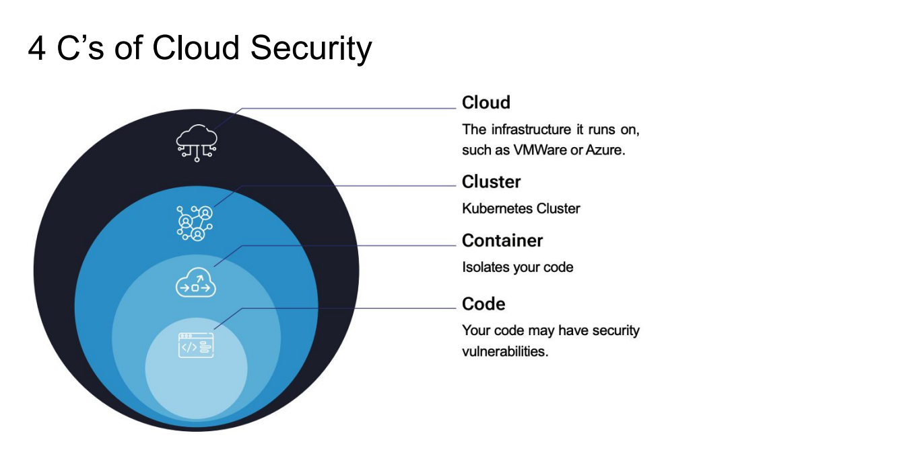]

---
class: title, shelf, no-footer, fullbleed
background-image: url(https://hashicorp.github.io/field-workshops-assets/assets/bkgs/HashiCorp-Title-bkg.jpeg)

## Module 2: Cluster Security

### Agenda
1. Kubernetes Cluster Security
2. Securing Clusters with RBAC
3. Security Auditing Tools

---

### 1. Kubernetes Cluster Security

#### Kubernetes Cluster Security Threats
- Kubernetes is entirely API-driven, it introduces several security threats that need to be mitigated
    - Unauthorized Access to the Kubernetes API
    - API Server Misconfigurations (anonymous access enabled...)
    - Exploiting Insecure API Endpoints
    - API Abuse (DDoS & Excessive API Requests)

    &#61;&#61;&gt; Understanding and addressing these possible threats are matter in K8s Cluster Security.

#### Kubernetes Cluster Security Mitigation
- Concentrate on:
    - Controlling access through RBAC mechanism.
    - Monitoring activity and enforcing security policies using external tools.

---

### 2. Securing Clusters with RBAC

#### What is RBAC
- Role-Based Access Control (RBAC) is a key mechanism in Kubernetes to restrict access to authorized users based on their roles and enforce the principle of least privilege.

- Key Concepts of RBAC in Kubernetes:
    - **Roles and ClusterRoles:** Define what a role can do
    ```yaml
        apiVersion: rbac.authorization.k8s.io/v1
        kind: Role
        metadata:
            name: pod-reader
        namespace: default
        rules:
        - apiGroups: [""]
          resources: ["pods"]
          verbs: ["get", "list", "watch"]
    ```
---

### 2. Securing Clusters with RBAC

#### What is RBAC
- Key Concepts of RBAC in Kubernetes:

    - **RoleBindings and ClusterRoleBindings:** Bind a particular subject to a particular role.
    ```yaml
        apiVersion: rbac.authorization.k8s.io/v1
        kind: RoleBinding
        metadata:
            name: pod-reader-binding
        namespace: default
        subjects:
            - kind: User
              name: john
              apiGroup: rbac.authorization.k8s.io
        roleRef:
            kind: Role
            name: pod-reader
            apiGroup: rbac.authorization.k8s.io
    ```
---

### 2. Securing Clusters with RBAC

#### What is RBAC
- Key Concepts of RBAC in Kubernetes:

    - **Subjects:** Subjects are the entities (users, groups, or service accounts) that are granted permissions through RoleBindings or ClusterRoleBindings.

        - **Users:** not actually exist in Kubernetes, but Kubernetes’ role binding can refer to them. Kubernetes expects an external identity provide to identify and authenticate users. 

        - **Service Accounts:** allow applications to communicate with the Kubernetes API, such as if an application was to automatically create and sign SSL certificates. 

.center[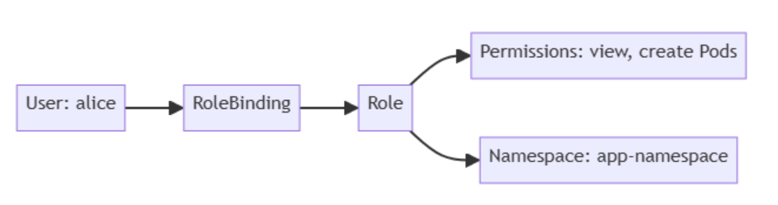]

---

### 2. Securing Clusters with RBAC

#### Benefits of RBAC

- **Granular Control:** RBAC allows for fine-grained access control, enabling administrators to specify exactly what actions users can perform on specific resources.

- **Least Privilege Principle:** By assigning only the necessary permissions to users based on their roles, RBAC helps enforce the principle of least privilege, reducing the risk of unauthorized access.

- **Ease of Management:** Roles and bindings can be easily managed and modified, making it simpler to adapt to changing organizational needs.

---

### 3. Security Auditing Tools

#### Why do we need tools?
- Kubernetes has many components with many settings, and knowing each and every one of their settings is unrealistic for most administrators. Instead, we use tooling to coach us towards best practices.

- **Efficiency:** Automate the process of identifying vulnerabilities, saving time and resources.

- **Improve Accuracy:** Reduce human error in vulnerability assessments and configuration checks.

- **Reporting:** Tools often provide detailed reports that help organizations understand their security status and prioritize remediation efforts.

#### We will setup and look at 2 great open source tools today:
- **kube-bench:** Compares kubernetes’ settings against established best practices (based-on CIS Benchmarks)

- **kube-hunter:** Attempts a pentest, via passively scanning or actively exploiting (penetration testing tool)

---

### 3. Security Auditing Tools

#### What is CIS Benchmark?
- A set of best practices and guidelines developed by the **Center for Internet Security (CIS)** 
- Provide detailed configuration recommendations for operating systems, applications, cloud providers and network devices.
- Following the CIS Benchmark guidelines helps to limit configuration-based security vulnerabilities in digital assets.

#### Key features:
- **Comprehensive Guidelines:** Each benchmark includes a list of security controls and configuration settings.
- **Consensus-Based:** Developed through collaboration among cybersecurity experts.
- **Regular Updates:** Benchmarks are updated to reflect the latest security threats and best practices.
- **Free and Open:** Available for organizations of all sizes to access and implement.

<br />
<br />
<span style="font-size: 0.8em;"> [1] [CIS Security Benchmarks](https://learn.cisecurity.org/benchmarks)</span> <br />
<span style="font-size: 0.8em;"> [2] [CIS AWS Foundations Benchmark example](https://aws.amazon.com/what-is/cis-benchmarks/)</span>

---

### 3. Security Auditing Tools

#### What is Penetration Testing?

- Penetration testing (pen testing) is a simulated cyber attack designed to find security weaknesses in a system.
- Helps assess how well a system can detect, prevent, and respond to threats or any vulnerabilities.
- **Benefits:** Identifies vulnerabilities, improves security posture, and helps meet compliance requirements.

.center[]

---

### 3. Security Auditing Tools

#### Kube-bench (CIS Benchmark Testing)  

- Kube-bench is  a tool that will scan your cluster to check how it matches up to the CIS security Benchmarks

.center[]

#### What Kube-bench can do?

- **Cluster hardening:** Kube-bench automates the process of checking the cluster configuration as per the security guidelines outlined in CIS benchmarks.

- **Policy Enforcement:** Kube-bench checks for RBAC configuration to ensure the necessary least privileges are applied to service accounts, users, etc. it also checks for pod security standards and secret management.

- **Network segmentation:** Kube-bench checks for CNI and its support for network policy to ensure that network policies are defined for all namespaces.

<span style="font-size: 0.8em;"> [1] [kube-bench reference](https://github.com/aquasecurity/kube-bench)</span>

---

### 3. Security Auditing Tools

#### Kube-bench demo


---

### 3. Security Auditing Tools

#### Kube-hunter (penetration testing tool)

- A tool that will try to explore you kubernetes cluster to find any vulnerabilities it can.

.center[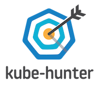]

#### What Kube-hunter can do?

- **Hunts for vulnerabilities** by probing the Kubernetes network, API, and services.

- Can **detect misconfigurations, exposed dashboards, weak authentication, and open ports**.

- Helps administrators **fix security issues before attackers exploit them**.

<br />
<span style="font-size: 0.8em;"> [1] [kube-hunter reference](https://github.com/aquasecurity/kube-hunter)</span>

---

### 3. Security Auditing Tools

#### Kube-hunter demo 


---

class: title, shelf, no-footer, fullbleed
background-image: url(https://hashicorp.github.io/field-workshops-assets/assets/bkgs/HashiCorp-Title-bkg.jpeg)

## Module 3: Container Security

### Agenda
1. Containers & Isolation Overview
2. Container Breakout
3. Preventing Container Breakout
4. Using Kubernetes' Built-in Security Features
5. Extending Security with External Tools

---

### 1. Containers & Isolation Overview

#### Containers
- A container offers an alternative to virtualization. It runs as a process in a host machine and uses various Linux kernel features to isolate the process.

#### Container Isolation
- **cgroup** - Limits CPU/RAM usage, preventing a single container from consuming all system resources.
- **chroot** - Changes the root directory to a subdirectory containing the container’s files, preventing access to the host filesystem.
- **Namespaces** - Ensures users, processes, networks, volume mounts, etc., are isolated to their own containers.

---

### 2. Container Breakout

#### What is container breakout?
- If an application is given escalated privileges, it could break out of its container and execute commands as if it were a user in the host OS.
- This allows an attacker to escape from a container to the host and move laterally across other containers.

.center[]

---

### 2. Container Breakout

#### Example
- A simple way to do this is to run as root and execute Linux kernel commands using a Perl script to change the root directory.
- [Pentest Monkey Chroot Breakout](https://pentestmonkey.net/blog/chroot-breakout-perl)

---

### 3. Preventing Container Breakout

- Using Kubernetes Security Context
    ```yaml
    apiVersion: v1
    kind: Pod
    metadata:
      name: security-context-demo
    spec:
      securityContext:
        runAsUser: 1000
        runAsGroup: 3000
        fsGroup: 2000
      containers:
        - name: nginx
          image: nginx
          securityContext:
            allowPrivilegeEscalation: false
            privileged: false
            runAsNonRoot: true
    ```

---
### 3. Preventing Container Breakout

- Avoid Mounting the Host’s Root Directory.
- Limit Service Account Privileges.
- Limit Linux Kernel Calls (by using SecComp, AppArmor).
  - Capabilities provide the ability to give a specific set of privileges to a thread/process
  - Can use *SecComp* and *AppArmor* tools to build policies and then enforce those across a number of namespaces or pods.

.center[]

---
### 3. Preventing Container Breakout

- Limit or add capabilities using the securityContext

```yaml
apiVersion: v1
kind: Pod
metadata:
  name: security-context-capa
spec:
  containers:
    - name: nginx
      image: nginx
      securityContext:
        capabilities:
          add: ["NET_ADMIN", "SYS_TIME"]        # adding NET_ADMIN, SYS_TIME for pod
```

---

### 4. Using Kubernetes' Built-in Security Features

#### Pod Security Admissions
- Kubernetes Pod Security Standards define three isolation levels:
    - **Privileged:** Unrestricted, allows privilege escalation.
    - **Baseline:** Minimal restrictions, prevents privilege escalation.
    - **Restricted:** Strong restrictions, follows best practices.

---
### 4. Using Kubernetes' Built-in Security Features

#### Pod Security Admissions

```yaml
default-ns.yaml

apiVersion: v1
kind: Namespace
metadata:
  name: default
  labels:
    pod-security.kubernetes.io/enforce: restricted
```

```yaml
nginx-pod.yaml

# This pod will not be allowed
apiVersion: v1
kind: Pod
metadata:
  name: nginx
spec:
  containers:
  - name: nginx
    image: nginx
```

---
### 4. Using Kubernetes' Built-in Security Features

#### Pod Security Admissions

```yaml
# This pod follows security best practices and is allowed
apiVersion: v1
kind: Pod
metadata:
  name: nginx-secure
spec:
  securityContext:
    runAsNonRoot: true
  containers:
  - name: nginx
    image: nginx
    securityContext:
      allowPrivilegeEscalation: false
      capabilities:
        drop: ["ALL"]
      seccompProfile:
        type: RuntimeDefault
```
---

### 4. Using Kubernetes' Built-in Security Features

#### Network Policies
- Kubernetes Network Policies allow limiting traffic to/from pods.
- Default: Wide open; policies can restrict ingress and egress.
- **Components:**
    - **Pod Selectors:** Determines applicable pods.
    - **Ingress:** Restricts incoming traffic.
    - **Egress:** Restricts outgoing traffic.

---

### 4. Using Kubernetes' Built-in Security Features

#### Network Policies

- Sample Network Policy: Deny All Ingress Traffic
    ```yaml
        apiVersion: networking.k8s.io/v1
        kind: NetworkPolicy
        metadata:
            name: default-deny-ingress
        spec:
            podSelector: {}
            policyTypes:
            - Ingress
    ```
- Sample Network Policy: Allow All Ingress Traffic
    ```yaml
        apiVersion: networking.k8s.io/v1
        kind: NetworkPolicy
        metadata:
            name: allow-all-ingress
        spec:
            podSelector: {}
            ingress:
            - {}
            policyTypes:
            - Ingress
    ```
---

### 5. Extending Security with External Tools

#### Why do we need External Tools?
- Built-in Kubernetes security features have limitations:

    - Namespace-wide limits.
    - Lack of granular control.
    - Pod security standards may not fit all workloads.

---

### 5. Extending Security with External Tools

#### Available Tools

- **OPA Gatekeeper** - Enforces policies to validate pods.

    - **Gatekeeper**: is a validating (allow or deny) and mutating (modify) admission webhook that enforces CRD-based policies executed by Open Policy Agent.

    - **OPA (Open Policy Agent)**: a policy engine for Cloud Native environments hosted by CNCF. 
        - OPA evaluates policy rules written in Rego, a declarative query language.
        - Returns a decision (Allow/Deny, True/False, or custom JSON) to the system that requested it.

.center[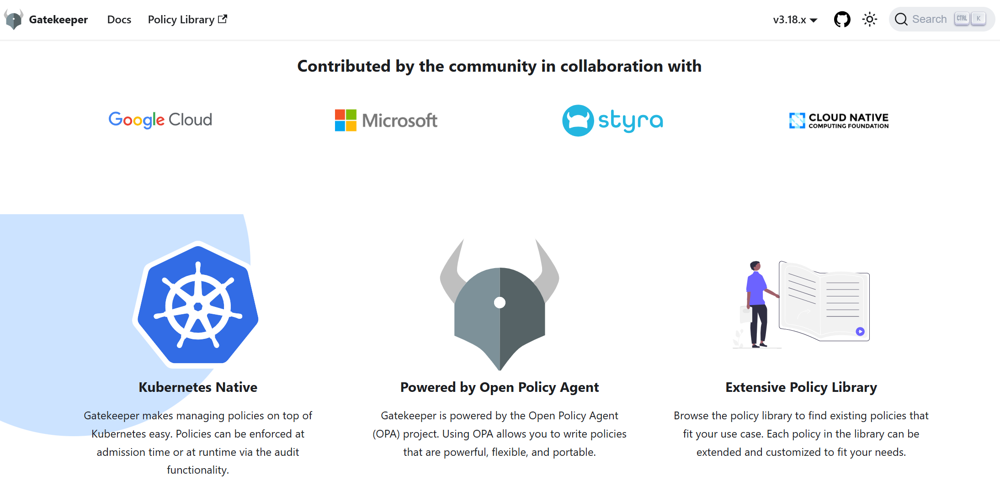]

<span style="font-size: 0.8em;"> [1] [open-policy-agent](https://open-policy-agent.github.io/gatekeeper/website/docs/)</span>

---

### 5. Extending Security with External Tools

#### Available Tools

- **OPA Gatekeeper demo**

.center[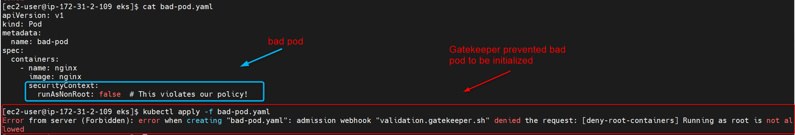]

---
### 5. Extending Security with External Tools

#### Available Tools

- **kubesec**: a security tool that analyzes Kubernetes manifests (YAML files) to detect security risks and misconfigurations.
- Helps ensure that Kubernetes workloads follow best security practices before deployment.

.center[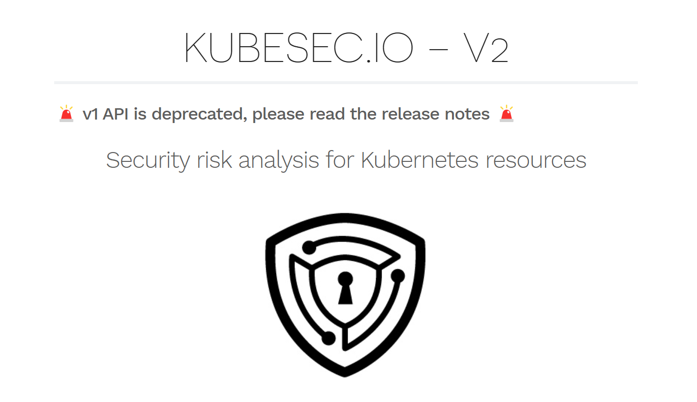]

- **Key Features**

    - **Security Scoring:** Assigns a risk score to Kubernetes resources based on security best practices.
    - **Detects Misconfigurations:** Finds issues like privileged containers, lack of security contexts, and weak RBAC settings.
    - **Simple Usage:** Can be used as a CLI tool or via a REST API for automation.

<br />
<span style="font-size: 0.8em;"> [1] [Kubesec.io](https://kubesec.io/)</span>

---
### 5. Extending Security with External Tools

#### Available Tools

- **kubesec demo**

.center[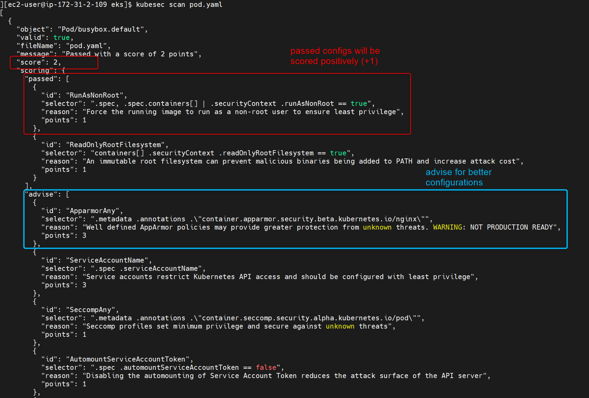] 

---

class: title, shelf, no-footer, fullbleed
background-image: url(https://hashicorp.github.io/field-workshops-assets/assets/bkgs/HashiCorp-Title-bkg.jpeg)

## Module 4: Code Security

### Agenda

1. Scanning Container Images for CVEs
2. Runtime Intrusion Detection

---

### 1. Vulnerability Scanning Container Images for CVEs

#### Vulnerability Scanning
- The process of identifying security weaknesses and flaws in systems, applications, or networks.
- It involves automated tools that scan for known vulnerabilities, misconfigurations, and outdated software.

<br />

.center[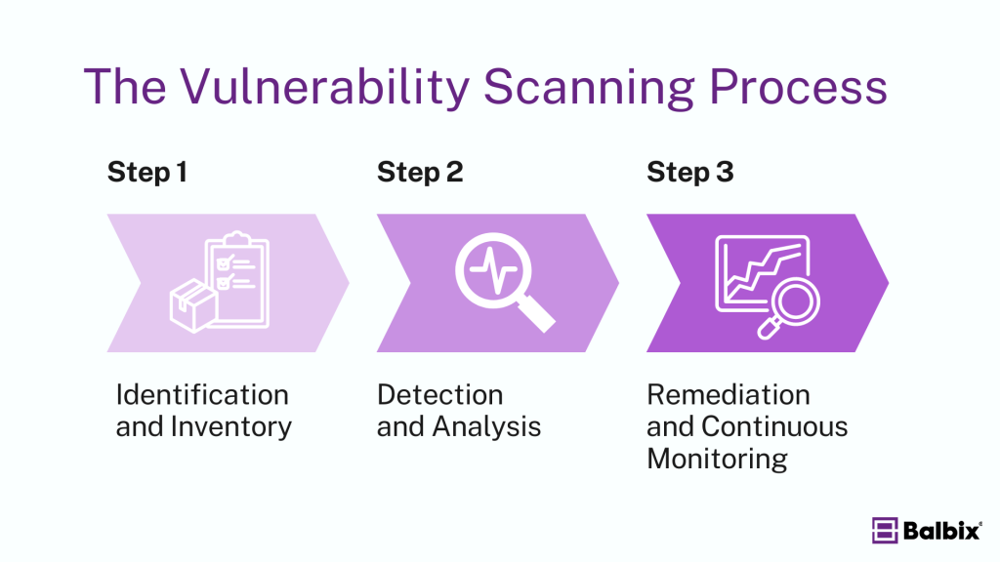]

---

### 1. Vulnerability Scanning Container Images for CVEs

#### What is CVEs
- **CVE (Common Vulnerabilities and Exposures):** A publicly disclosed list of known cybersecurity vulnerabilities and exposures.
- CVEs help organizations **identify and address known vulnerabilities** in their software and systems.
- Each CVE entry includes:
    - A unique identifier
        ```sh
        CVE-2023-5528
        ```
    - A description of the vulnerability
        ```sh
        Kubernetes versions prior to 1.27.4 contain a vulnerability where a user with certain permissions can escalate privileges due to improper RBAC policy enforcement.
        ```
    - References to related information
        ```sh
        🔗 NVD Entry - https://nvd.nist.gov/vuln/detail/CVE-2023-5528
        🔗 Kubernetes Security Advisory - https://kubernetes.io/security/advisories/
        🔗 GitHub Issue - https://github.com/kubernetes/kubernetes/issues/12345
        ```

---

### 1. Vulnerability Scanning Container Images for CVEs

#### CVE Scanning with Trivy

- **Trivy:** an open-source vulnerability scanner designed specifically for container images and file systems.
- Scan for known CVEs in container images, identifying vulnerabilities in the software packages and libraries included in the image.

.center[]

#### Key features:
- **Container Image Scanning** – Finds vulnerabilities in Docker/OCI images.
- **Kubernetes Security Scanning** – Detects misconfigurations in K8s clusters and Helm charts.
- **Secret Detection** – Identifies hardcoded secrets in code and configs.
- **Fast and Easy to Use** – Lightweight with no extra dependencies.

<br />
<span style="font-size: 0.8em;"> [1] [Trivy Reference](https://github.com/aquasecurity/trivy)</span>

---

### 1. Vulnerability Scanning Container Images for CVEs

#### How Trivy works:

.center[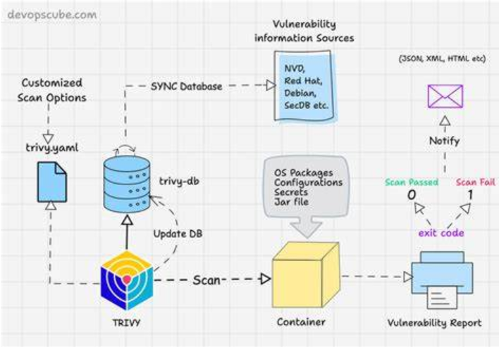]

---

### 1. Vulnerability Scanning Container Images for CVEs

#### Trivy demo:


---

### 2. Runtime Intrusion Detection

#### Intrusion Detection
- The practice of monitoring systems or networks for malicious activity or policy violations.
- Help identify unauthorized access, cyberattacks, and other threats before they cause serious damage using Intrusion Detection Systems (IDS).

<br />

.center[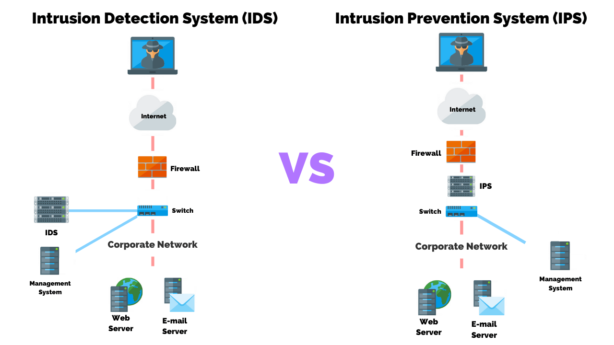]

---

### 2. Runtime Intrusion Detection

#### Intrusion Detection with Falco Project
- **Project Falco:** an open-source runtime security tool for monitoring suspicious activity
- Provides real-time security detection for containers, hosts, Kubernetes, and cloud environments.
- It works as a network of security cameras for our infrastructure.
.center[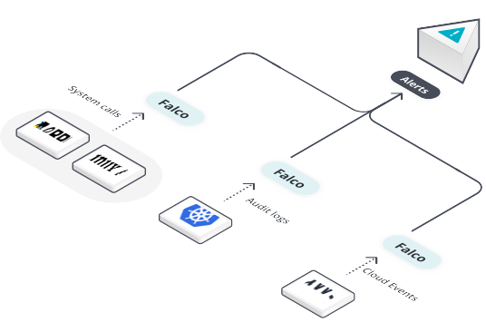]

<span style="font-size: 0.8em;"> [1] [Falco Introduction](https://falco.org/about/)</span> <br />
<span style="font-size: 0.8em;"> [2] [More about Falco](https://sysdig.com/learn-cloud-native/what-is-falco/)</span>

---

### 2. Runtime Intrusion Detection

#### How Falco works?
- Collects event data from sources:
    - Linux kernel syscalls
    - Kubernetes audit logs
    - Cloud events (e.g. AWS CloudTrail)
    - Events from other systems (GitHub, Okta)
    - New data sources can be added to Falco by developing plugins
- Compares events against a set of rules to detect suspicious behavior.
- Alerts on malicious activities in real time.
.center[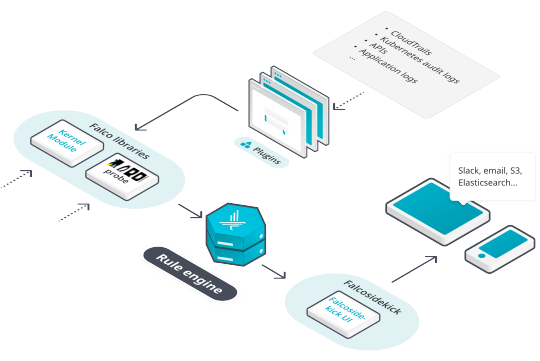]

---

### 2. Runtime Intrusion Detection

#### Falco demo

---

class: center, middle, title, shelf, no-footer, fullbleed
background-image: url(https://hashicorp.github.io/field-workshops-assets/assets/bkgs/HashiCorp-Title-bkg.jpeg)

## Module 5. Demo

---

#### All-in-one with M9Sweeper

.center[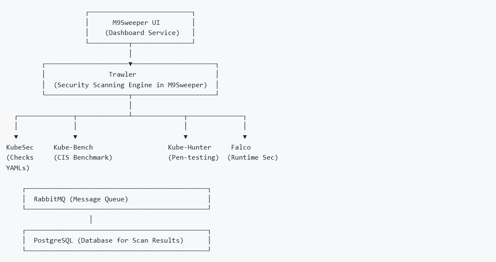]

---

## Reference

- **DevOpsCon - Kubernetes Security Workshop:** 
    - Workshop Introduction: [Link](https://devopscon.io/kubernetes-ecosystem/kubernetes-security-workshop/)  
    - Slide: [Google Slides](https://docs.google.com/presentation/d/1b8P19XOtsLzpS5vJtlUhzTVPEByhEQB6wBGotc7c_PE/edit#slide=id.g2010fd6445c_0_667)  
- **Jake - Short Kubernetes Security Workshop:** 
    - Workshop PDF: [Link](https://conf42.github.io/static/slides/Conf42%20Kube%20Native%202023%20-%20Jacob%20Beasley.pdf)  
    - Lab Guide: [View lab guides](https://docs.google.com/document/d/18wwz2vxDK1kdvCyUMXdr7XcKF0bQ8yrfuRi067RwP8A/edit?tab=t.0#heading=h.3qrtvg9967oy)  
- **Scotty - Kubernetes Security Workshop:** 
    - GitHub Repository: [Link](https://github.com/scotty-c/kubernetes-security-workshop/tree/master)
- **Trivy:** [trivy](https://github.com/aquasecurity/trivy)
- **Kubesec:** [kubesec](https://github.com/controlplaneio/kubesec)
- **Kube-bench:** [kube-bench](https://github.com/aquasecurity/kube-bench)
- **Kube-hunter:** [kube-hunter](https://github.com/aquasecurity/kube-bench)
- **Project Falco:** [Project Falco](https://falco.org/about/)
- **Gatekeeper Introduction:** [Referral Link](https://open-policy-agent.github.io/gatekeeper/website/docs/)
- **Kubernetes Cluster Security:** [Link](https://kubernetes.io/docs/tasks/administer-cluster/securing-a-cluster/)
- **Cybereason - Container Escape:** [Link](https://www.cybereason.com/blog/container-escape-all-you-need-is-cap-capabilities)
- **Open Policy Agent Introduction:** [Referral Link](https://www.openpolicyagent.org/)
- **OWASP - Kubernetes Security Cheat Sheet:** [Referral Link](https://cheatsheetseries.owasp.org/cheatsheets/Kubernetes_Security_Cheat_Sheet.html)
- **OPA Gatekeeper: Policy and Governance for Kubernetes:** [Referral Link](https://kubernetes.io/blog/2019/08/06/opa-gatekeeper-policy-and-governance-for-kubernetes/)
- **Pentestmonkey - Breaking Out of a Chroot Jail Using PERL:** [Referral Link](https://pentestmonkey.net/blog/chroot-breakout-perl)